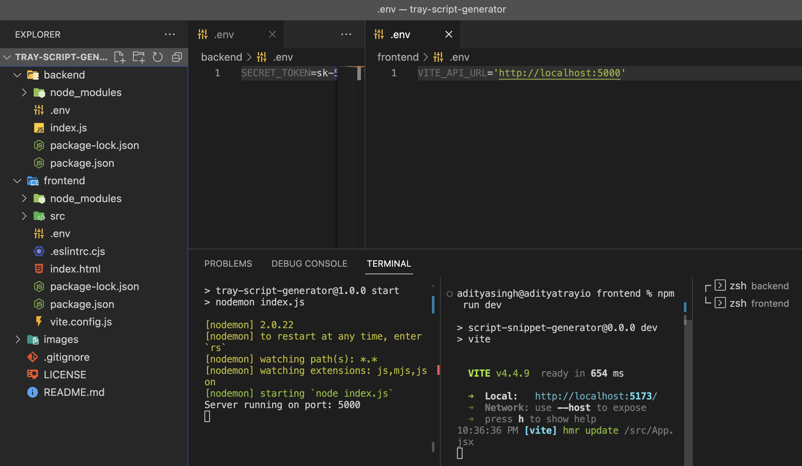

# Script snippet generator

This app will generate Tray.io script snippets that can be pasted into the builder directly.

Here is a loom recording with an example:

## Instructions

- Login to your OpenAI developer account and create an [API key](https://platform.openai.com/account/api-keys). You can obviously use an existing one. Copy the API Key as it will be added to the `.env` file.
- Clone the repo.

### Backend

- In the backend folder root, add a `.env` file with following content: `SECRET_TOKEN=<YOUR_OPEN_AI_API_KEY>`
- Open terminal in the backend folder, run `npm i` followed by `npm start`.

**If the server fails to start with the `port in use` error, update the PORT in the index.js to a free port**

### Frontend

- Now switch to the frontend folder.
- Create a `.env` file with the following content: `VITE_API_URL='http://localhost:5000'` . This is assuming your backend server is running on port 5000.

- Open terminal in the backend folder, run `npm i` followed by `npm run dev`.

**The step above should start the frontend server on `http://localhost:5173` ideally. (Port may be 5174/5175... and so on depending on avaialbility on your machine).**

Now you can open the link in browser and use the tool.

Here's how the folder structure should look:

